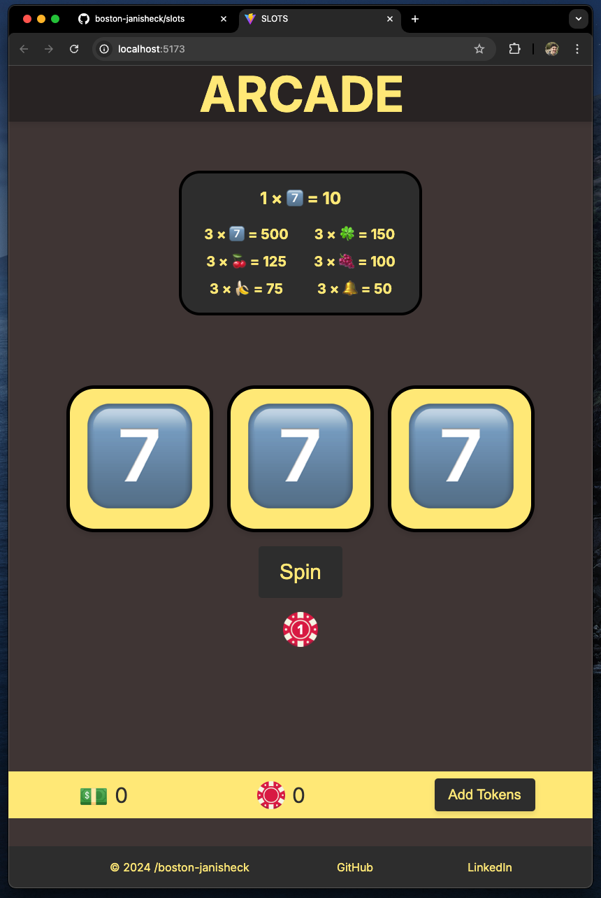

# Slots Game 🎰

This is a work-in-progress slots game built using React. The game allows players to spin a set of three slots, wager tokens, and accumulate points based on the results. More features and enhancements will be added as development progresses.

## Features

**Spin the Slots:** Players can spin the slots with a customizable wager.

**Point Calculation:** Points are awarded based on the combination of symbols that appear after a spin. Different symbols have different point values.

**Cumulative Score:** Track your total points as you continue playing.

**Token Balance:** Manage your token balance to ensure you have enough to place wagers.

**Sound Effects:** Sound effects for spins, wins, and other actions.

## How to Play

**Set Your Wager:** Use the wager button to set the amount you'd like to wager for each spin.

**Spin the Slots:** Click the spin button to start the slots. The symbols will roll and stop at different intervals.

**Earn Points:** Points are awarded based on the symbols displayed and the amount wagered.

**Add More Tokens:** If you run out of tokens, use the interface to add more and continue playing.

## Points Key

The game uses the following point system:

- 1x7️⃣: 10 points
- 3x7️⃣: 500 points
- 3x🍀: 150 points
- 3x🍒: 125 points
- 3x🍇: 100 points
- 3x🍌: 75 points
- 3x🔔: 50 points

A 7️⃣ is similar to a free space, allowing other icons to receive their '3x' points rewards.

## Future Features

**Enhanced Visual Effects:** Additional animations and effects during spins.

**Shop Feature:** Players will be able to purchase tokens or other in-game items.

## Getting Started

To run this project locally:

- Clone the repository.
- Install dependencies using npm install.
- Start the development server with npm start.

The code of this project is made entirely by Boston Janisheck
